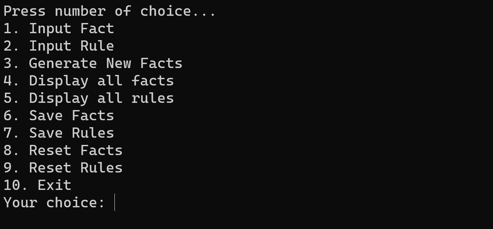

# Forward Chaining
Forward chaining is a form of reasoning that starts with simple facts in the knowledge base and applies inference rules in the forward direction to extract more data until a goal is reached.
## Features

  `1.` **Input Fact:** Allows users to input facts into the system, providing the initial data for forward chaining inference.

  `2.` **Input Rule:** Enables users to input rules, specifying the logical conditions and actions that guide the forward chaining process.

`3.` **Generate New Facts:** Utilizes the input facts and rules to generate new facts through the forward chaining inference mechanism.

`4.` **Display all facts:** Shows all the facts currently available in the system, providing transparency into the knowledge base.

`5.` **Display all rules:** Displays a list of all rules in the system, allowing users to review and understand the logic guiding the inference.

`6.` **Save Facts:** Enables users to save the current set of facts, preserving the state of the knowledge base for future reference. (Stored in `facts.json`)

`7.` **Save Rules:** Allows users to save the defined rules, ensuring that the logical conditions and actions are stored for future use. (Stored in `rules.json`)

`8.` **Reset Facts:** Clears the existing facts, providing a clean slate for inputting new facts and restarting the forward chaining process.

`9.` **Reset Rules:** Clears the defined rules, allowing users to redefine the logical conditions and actions for forward chaining.

## Files

- **facts.json**: Contains saved facts.
- **rules.json**: Contains saved rules.
- **complete_rules.json**: Contains saved rules that form sentences.

## Getting Started

1. **Clone the Repository:**
   ```bash
   git clone https://github.com/clydexavier/Forward-Chaining
   ```
2. **Navigate to the Project Directory:**
   ```bash
    cd Forward-Chaining
    cd src
   ```
3. **Run the Program:**
   ```bash
   python ForwardChaining.py
   ```

## Example

   
